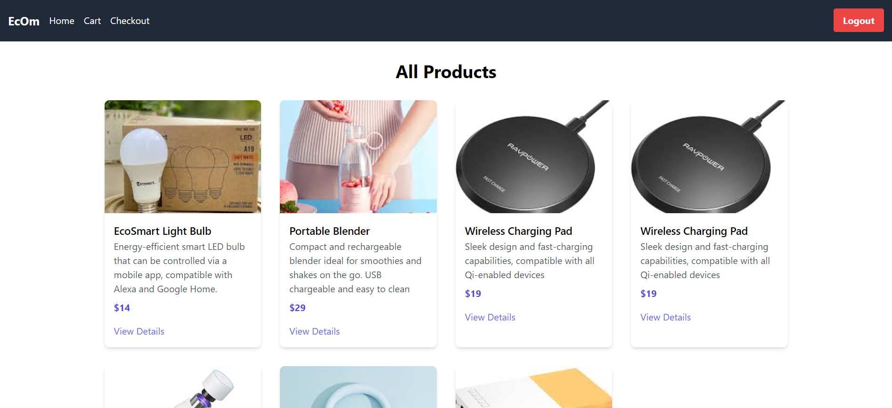
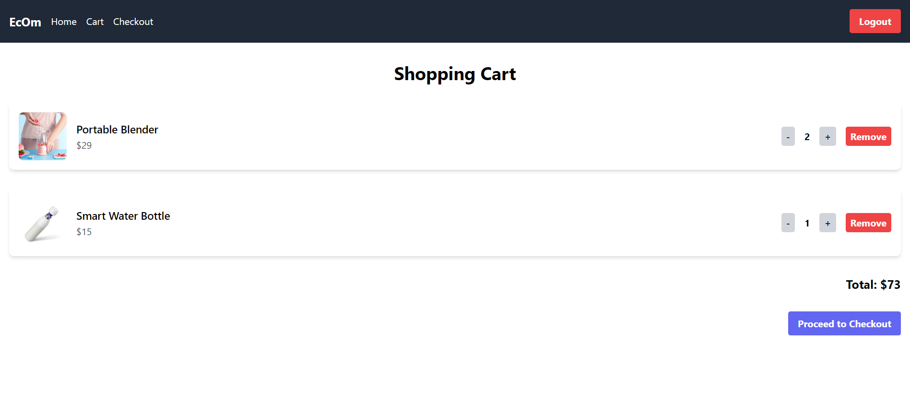

# E-Commerce Platform

A fully functional e-commerce platform built with React.js, Redux, and TailwindCSS for the frontend and Express.js for the backend. The application includes features such as product listing, product details, cart management, checkout process, user authentication, and more.
## Demo

Watch the demo on YouTube: [E-Commerce Platform Demo](https://www.youtube.com/watch?v=FNIzKc1O4-M)

## Features

- **Product Listing**: Display a list of products fetched from an API.
- **Product Details**: View detailed information about each product.
- **Cart Management**: Add, remove, and manage product quantities in the cart.
- **Checkout Process**: Multi-step checkout process including shipping and payment details.
- **User Authentication**: Sign up, log in, and log out functionality using JWT.
- **Responsive Design**: Fully responsive design using TailwindCSS.
- **Notifications**: User feedback through toast notifications using `react-toastify`.

## Screenshots






## Setup and Installation

### Prerequisites

- Node.js (v14.x or later)
- npm or yarn

### Backend Setup

1. Clone the repository:

   ```sh
   git clone https://github.com/yourusername/ecommerce-platform.git
   cd ecommerce-platform
   ```

2. Navigate to the backend directory and install dependencies:

   ```sh
   cd backend
   npm install
   ```

3. Create a `.env` file in the backend directory and add the following environment variables:

   ```env
   PORT=5000
   MONGO_URI=your_mongodb_connection_string
   JWT_SECRET=your_jwt_secret
   ```

4. Start the backend server:

   ```sh
   npm start
   ```

### Frontend Setup

1. Navigate to the frontend directory and install dependencies:

   ```sh
   cd frontend
   npm install
   ```

2. Start the frontend development server:

   ```sh
   npm start
   ```

### Running the Application

- Ensure both backend and frontend servers are running.
- Open your browser and navigate to `http://localhost:3000` to view the application.

## Usage

- **Home Page**: View all products.
- **Product Details**: Click on a product to view details.
- **Add to Cart**: Add products to your cart from the product details page.
- **Checkout**: Proceed to checkout from the cart page.
- **Authentication**: Sign up or log in to manage your cart and checkout.

## Technologies Used

### Frontend

- React.js
- Redux
- TailwindCSS
- react-router-dom
- react-toastify

### Backend

- Express.js
- MongoDB
- Mongoose
- JWT for authentication

## Contributing

Contributions are welcome! Please fork the repository and submit a pull request for any changes you would like to make.

1. Fork the Project
2. Create your Feature Branch (`git checkout -b feature/YourFeature`)
3. Commit your Changes (`git commit -m 'Add some feature'`)
4. Push to the Branch (`git push origin feature/YourFeature`)
5. Open a Pull Request

## License

Distributed under the MIT License. See `LICENSE` for more information.

## Contact

Muhammad Awais Khan - [awaiskhanniazi963@gmail.com](mailto:awaiskhanniazi963@gmail.com)

Project Link: [https://github.com/askhan963/ecommerce-platform](https://github.com/askhan963/ecommerce-platform)


